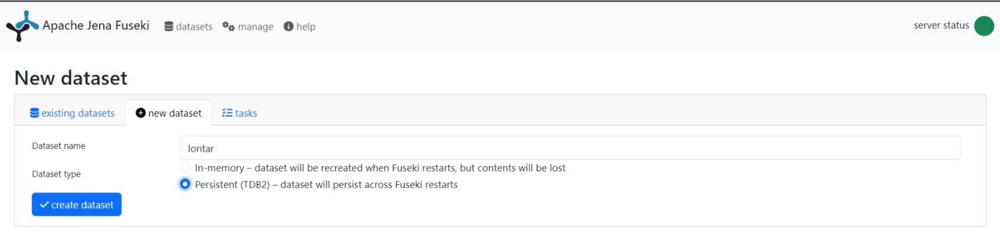
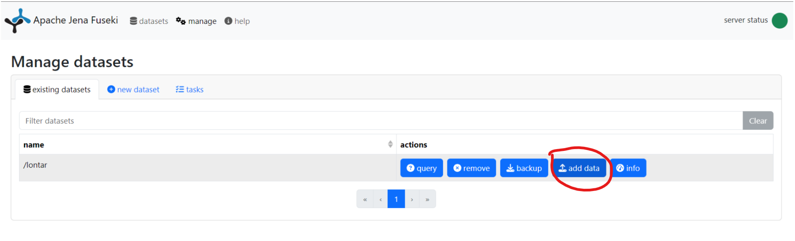
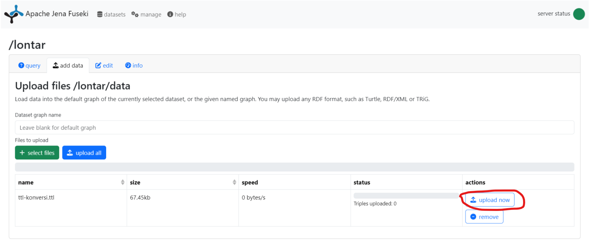
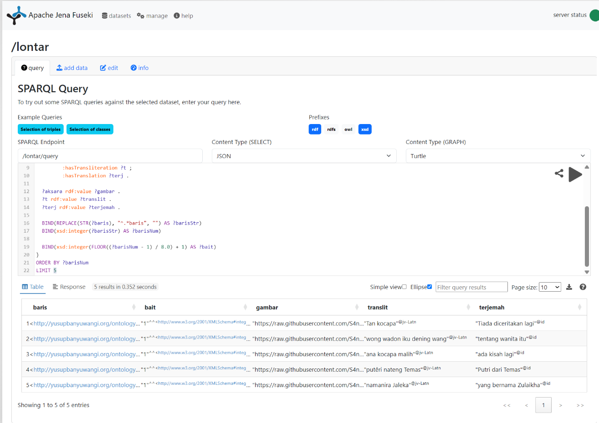

# Proyek-Akhir-Semantik-Web

---

# Dokumentasi Pembuatan SPARQL Endpoint

### Tools yang Digunakan

Database graph yang digunakan adalah **Apache Jena Fuseki** sebagai triple store RDF dan penyedia endpoint SPARQL.

---

## Langkah-Langkah

### 1. Download dan Jalankan Apache Jena Fuseki

Unduh Fuseki dari situs resmi: [https://jena.apache.org/download/](https://jena.apache.org/download/)

Setelah diekstrak, jalankan server:

```bash
./fuseki-server
```

_Contoh terminal saat menjalankan Fuseki:_

## 

### 2. Akses Antarmuka Web Fuseki

Buka browser ke alamat:

```
http://localhost:3030
```

Klik **"New Dataset"**, isi sebagai berikut:

- **Dataset name:** `lontar`
- **Dataset type:** Persistent (TDB2)

Lalu klik tombol **Create Dataset**.

_Gambar antarmuka saat membuat dataset:_



---

### 3. Upload File RDF (TTL)

Setelah dataset berhasil dibuat, klik **"Add Data"** → pilih **"Select files"** → upload file RDF Turtle (`.ttl`) yang sudah dibuat.

Klik **Upload Now**.

_Gambar proses upload TTL:_




---

### 4. Menjalankan Query SPARQL

Klik tab **"Query"**, lalu masukkan query berikut:

```sparql
PREFIX : <http://yusupbanyuwangi.org/ontology#>
PREFIX rdf: <http://www.w3.org/1999/02/22-rdf-syntax-ns#>
PREFIX xsd: <http://www.w3.org/2001/XMLSchema#>

SELECT ?baris ?baitClean ?gambarClean ?translitClean ?terjemahClean
WHERE {
  ?baris a :BarisNaskah ;
         :mengandungAksara ?aksara ;
         :hasTransliteration ?t ;
         :hasTranslation ?terj .

  ?aksara rdf:value ?gambar .
  ?t rdf:value ?translit .
  ?terj rdf:value ?terjemah .

  BIND(REPLACE(STR(?baris), "^.*baris", "") AS ?barisStr)
  BIND(xsd:integer(?barisStr) AS ?barisNum)
  BIND(xsd:integer(FLOOR((?barisNum - 1) / 8.0) + 1) AS ?bait)

  # Membersihkan hasil agar tanpa tipe data atau tag bahasa
  BIND(STR(?bait) AS ?baitClean)
  BIND(STR(?gambar) AS ?gambarClean)
  BIND(STR(?translit) AS ?translitClean)
  BIND(STR(?terjemah) AS ?terjemahClean)
}
ORDER BY ?barisNum
```

_Gambar halaman query dan output SPARQL:_



---

### 5. Output yang Ditampilkan

Query ini akan menampilkan:

- URI baris naskah
- Nomor bait (otomatis dihitung, 1 bait = 8 baris)
- Gambar (tautan URL aksara Pegon)
- Transliterasi Latin (bahasa Jawa)
- Terjemahan Bahasa Indonesia

---

## Integrasi ke Web UI

Dari endpoint:

```
http://localhost:3030/lontar/sparql
```

kita bisa membangun **FastAPI sebagai penghubung ke UI berbasis Streamlit**.

- FastAPI akan mengeksekusi SPARQL query
- Streamlit akan menampilkan hasilnya dalam bentuk visual antarmuka

---
