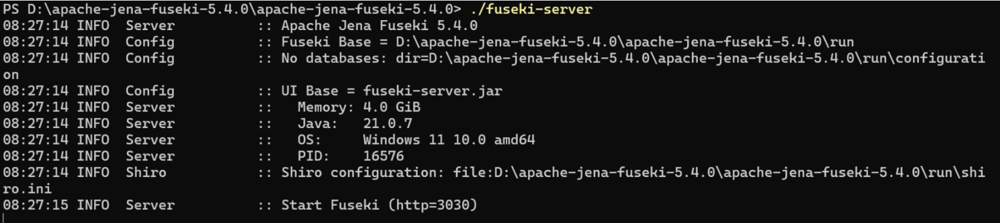
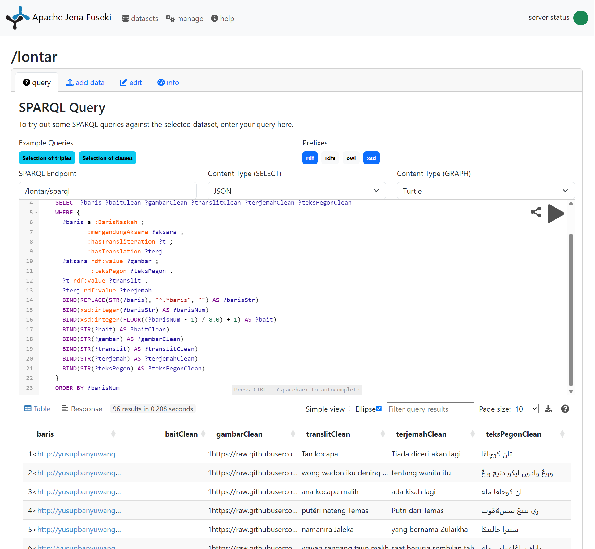
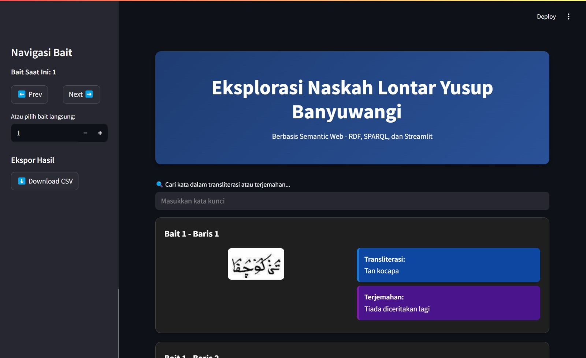
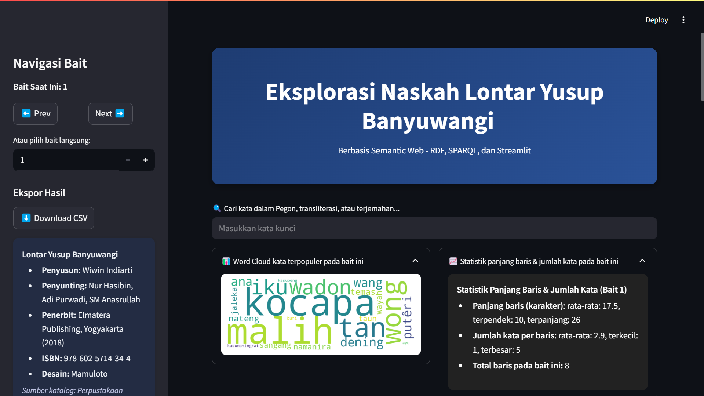
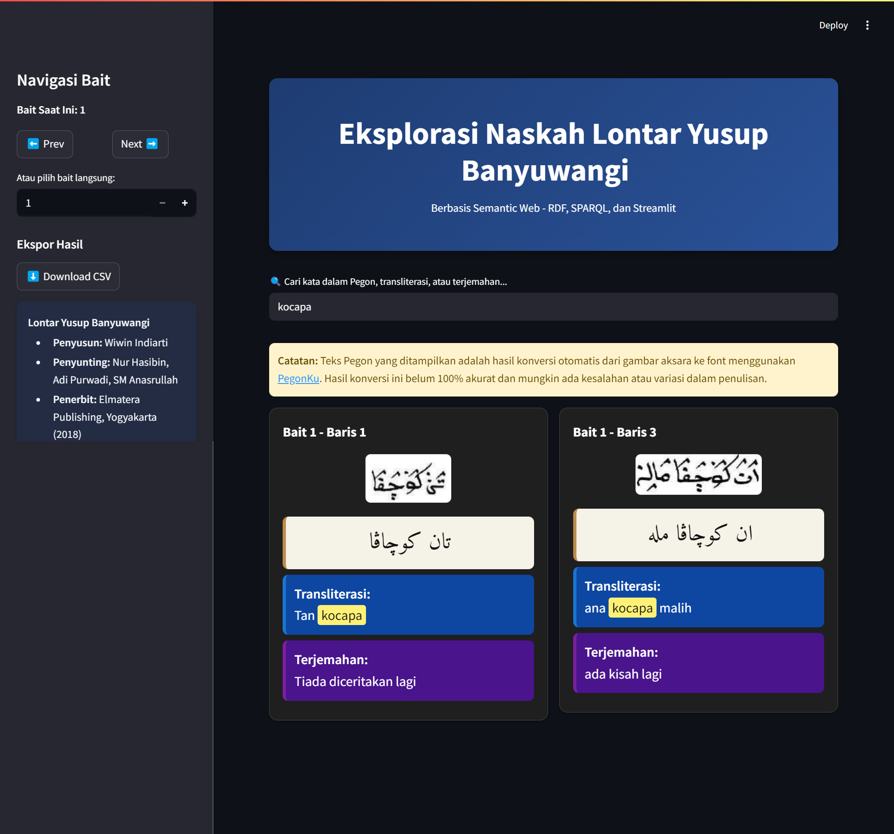

# Proyek-Akhir-Semantik-Web

## Instalasi dan Persiapan Awal

Sebelum memulai, pastikan semua kebutuhan environment sudah terpasang.

1. **Install requirement Python** dengan menjalankan perintah berikut di terminal:

```bash
pip install -r requirements.txt
```

_File `requirements.txt` berisi dependencies seperti:
`streamlit`, `SPARQLWrapper`, `pandas`, `matplotlib`, dan lainnya._

2. **Download Apache Jena Fuseki** dari:
   [https://jena.apache.org/download/](https://jena.apache.org/download/)

---

## 1. Pembuatan SPARQL Endpoint dengan Apache Jena Fuseki

```bash
./fuseki-server
```

_Tampilan terminal saat menjalankan Fuseki:_



---

### 1.2. Akses Antarmuka Web Fuseki

Buka browser ke:

```
http://localhost:3030
```

Klik **"New Dataset"**, isi sebagai berikut:

- Dataset name: `lontar`
- Dataset type: Persistent (TDB2)

Klik tombol **Create Dataset**.

_Gambar antarmuka saat membuat dataset:_


---

### 1.3. Upload File RDF (TTL)

Setelah dataset berhasil dibuat, klik **Add Data** → pilih **Select files** → upload file RDF Turtle (`ttl-konversi-pegon.ttl`) yang sudah dibuat.

Klik **Upload Now**.

_Gambar proses upload TTL:_


---

### 1.4. Menjalankan Query SPARQL

Klik tab **Query**, lalu masukkan query berikut:

```sparql
PREFIX : <http://yusupbanyuwangi.org/ontology#>
PREFIX rdf: <http://www.w3.org/1999/02/22-rdf-syntax-ns#>
PREFIX xsd: <http://www.w3.org/2001/XMLSchema#>
SELECT ?baris ?baitClean ?gambarClean ?translitClean ?terjemahClean ?teksPegonClean
WHERE {
  ?baris a :BarisNaskah ;
         :mengandungAksara ?aksara ;
         :hasTransliteration ?t ;
         :hasTranslation ?terj .
  ?aksara rdf:value ?gambar ;
          :teksPegon ?teksPegon .
  ?t rdf:value ?translit .
  ?terj rdf:value ?terjemah .
  BIND(REPLACE(STR(?baris), "^.*baris", "") AS ?barisStr)
  BIND(xsd:integer(?barisStr) AS ?barisNum)
  BIND(xsd:integer(FLOOR((?barisNum - 1) / 8.0) + 1) AS ?bait)
  BIND(STR(?bait) AS ?baitClean)
  BIND(STR(?gambar) AS ?gambarClean)
  BIND(STR(?translit) AS ?translitClean)
  BIND(STR(?terjemah) AS ?terjemahClean)
  BIND(STR(?teksPegon) AS ?teksPegonClean)
}
ORDER BY ?barisNum
```

_Gambar halaman query dan output SPARQL:_



---

### 1.5. Output yang Ditampilkan

Query akan menampilkan:

- URI baris naskah
- Nomor bait (otomatis dihitung, 1 bait = 8 baris)
- Gambar (tautan URL aksara Pegon)
- Transliterasi Latin (bahasa Jawa)
- Terjemahan Bahasa Indonesia
- Aksara Pegon dalam Unicode

---

## 2. Penggunaan Data di Aplikasi Web Streamlit

### 2.1. Endpoint SPARQL

Gunakan endpoint Fuseki berikut untuk query dari aplikasi:

```
http://localhost:3030/lontar/sparql
```

---

### 2.2. Menjalankan Aplikasi Streamlit

Jalankan aplikasi Streamlit yang sudah disiapkan (misal file `app-fix.py`):

```bash
streamlit run app-fix.py
```

---

### 2.3. Fitur Utama Aplikasi

- Navigasi dan filter berdasarkan bait dan baris naskah
- Kolom pencarian kata/frasa dalam transliterasi dan terjemahan
- Tampilan tabel berisi:

  - Gambar aksara Pegon
  - Teks Unicode Pegon (bisa di-copy)
  - Translitrasi Latin
  - Terjemahan Bahasa Indonesia

- Statistik dan Wordcloud kata populer per bait
- Ekspor hasil pencarian/statistik ke CSV

---

## 3. Panduan Pengguna & Contoh Hasil

### 3.1. Panduan Penggunaan

1. **Buka aplikasi Streamlit**, antarmuka utama akan menampilkan pilihan bait/baris, kolom pencarian, dan tombol fitur lainnya.
2. **Navigasi** untuk melihat isi naskah per bait/baris.
3. **Cari kata/frasa** tertentu untuk memfilter baris yang relevan.
4. **Salin teks Pegon Unicode** langsung dari tabel hasil.
5. **Ekspor data** hasil pencarian atau statistik ke CSV untuk analisis lebih lanjut.

---

### 3.2. Contoh Output di Web UI Streamlit

- Tampilan data per bait/baris:

  

- Statistik dan Wordcloud:

  

- Hasil pencarian kata, misal “kocapa”:

  

---

### 3.3. Catatan Penggunaan

- **Akurasi Unicode Pegon** belum 100% sempurna karena proses konversi dari gambar menggunakan tools semi-manual seperti [PegonKu](https://pegonku.vercel.app/indo-pegon).
- Lakukan validasi manual jika ditemukan keanehan atau error pada teks Pegon.

---

### 3.4. Tips dan Troubleshooting

- Jika data tidak muncul, cek apakah Fuseki server dan dataset sudah berjalan dan terupload dengan benar.
- Pastikan endpoint dan query SPARQL dapat diakses dari aplikasi.

---
